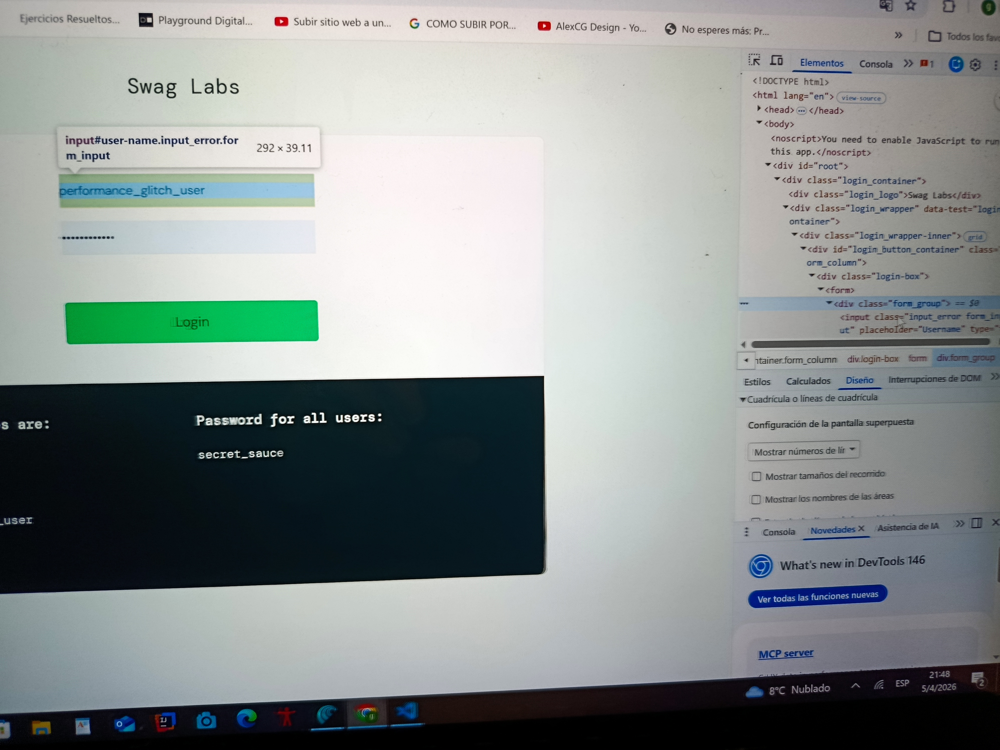
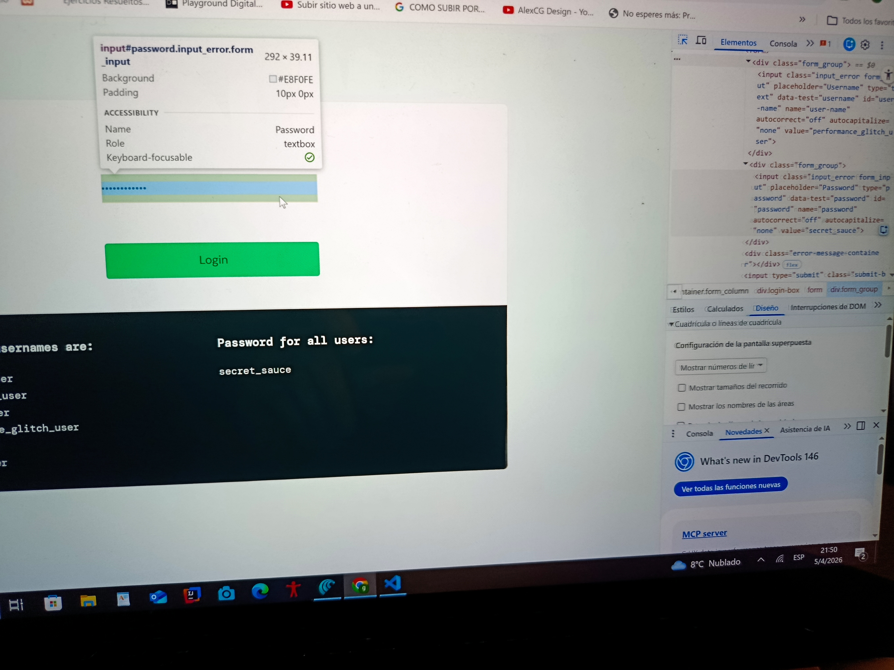
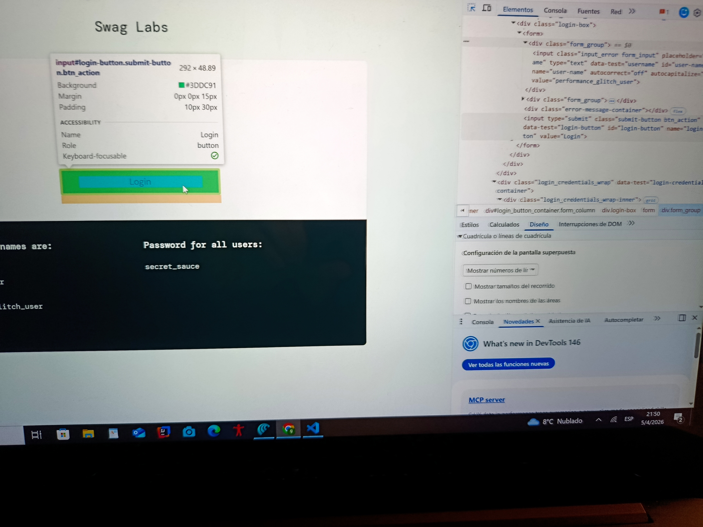
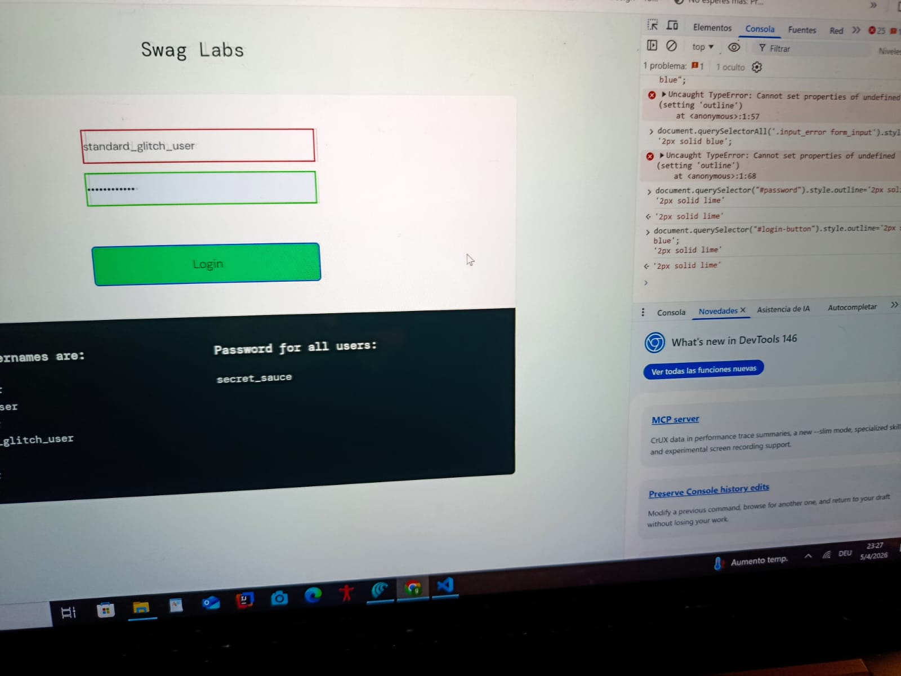
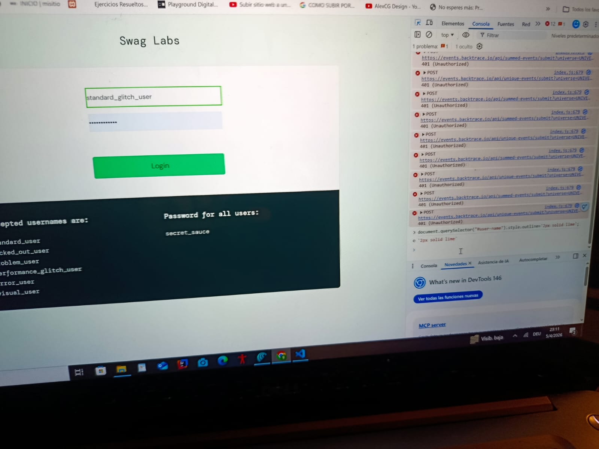
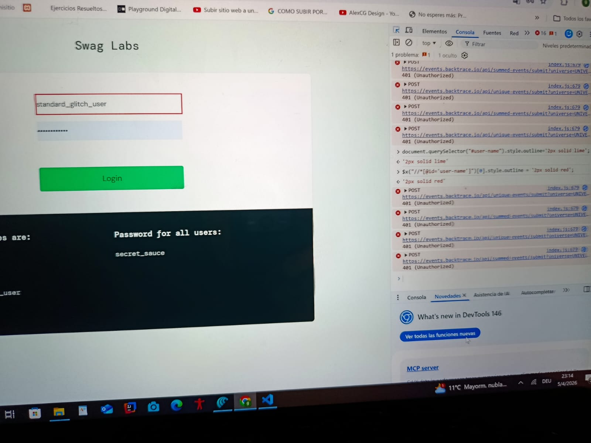

<!--Herramientas listas:

Abre la URL elegida.

Pulsa F12 → pestaña Elements.

Activa el ícono del cursor para seleccionar nodos.

2. Selector CSS primero:

Haz clic sobre el input usuario.

¿Tiene id="user-name"? Perfecto: #user-name.¿No hay id? Busca un name o clase exclusiva:

input[name="username"]

.login_input[type="text"]

Repite con contraseña y botón.

3. XPath de respaldo

Por id: //*[@id='user-name']

Por name: //input[@name='password']

Por texto del botón: //button[normalize-space()='Login']

Nunca uses rutas absolutas largas — si el Front mueve un 
 se rompe todo.

4. Verifica en Console

document.querySelector('#user-name').style.outline = '2px solid lime';

Verás que se pone en color lima el borde del input de user-name

Sino también por XPath

$x("//*[@id='user-name']")[0].style.outline = '2px solid red';

Debe pintar exactamente un elemento. Si es null o selecciona varios, afina el selector.

Ejercicio Práctico

Obligatorio

 Paso a paso detallado:

5. Rellena selectores-talento.mdEjemplo:

6. Snippet de test masivo

Este snippet permite verificar rápidamente si tus selectores CSS apuntan a los elementos correctos. Recorre una lista de selectores y les cambia el fondo a color khaki. Si un campo no se pinta, es señal de que el selector está mal o no es único. Así confirmás visualmente que tu tabla de selectores funciona antes de usarla en Selenium.

['#user-name','input[type="password"]','.btn_action'].forEach(sel=>{

const el=document.querySelector(sel);

if (el) el.style.background='khaki';

});

Ejecuta; si los tres campos se vuelven amarillos, ¡selector validado! -->

<!-- Punto 1- -->

<!-- Punto 2- -->

elemento                  -                       selector              -                              css
Usuario input                                   id="user-name"                                        #user-name    
                                                class="input_error form_input"                        .input_error form_input[type="text"]     
                                                 input[name="user-name"]     
 
Password input                                  id="password"                                         #password
                                                class="input_error form_input"                        .input_error form_input[type="password"]
                                                input[name="password"]

submit button                                   id="login-button"                                      #login-button
                                                class="submit-button btn_action"                       .submit-button btn_action[type="submit"]
                                                input[name="login-button"]             

<!-- Punto 3  XPath- -->
<!--Usuario -->
 id: //*[@id='user-name']
 name: //input[@name='user-name']
 class://*[@class='input_error form_input']  
 <!--Password -->
  id: //*[@id='password']
 name: //input[@name='password']
 class://*[@class='input_error form_input']  
 <!--Button -->
  id: //*[@id='login-button']
 name: //input[@name='login-button']
 class://*[@class='submit-button btn_action']  

<!--Punto 4   Verifica en Consola -->

['#user-name','input[type="password"]','.btn_action'].forEach(sel=>{

const el=document.querySelector(sel);

if (el) el.style.background='khaki';

});

Elemento         |      Selector elegido        |    Tipo      |          Razon                      |
Usuario                  #user-name                  CSS           Id unico, claro y muy estable en la pagina 
Usuario                  //*[@id='user-name']        XPath         Directo al id, facil de leer y mantener 
Usuario                  //input[@name='user-name']  XPath         Usa el name, alternativo si cambia el id 
Contrasena               #password                   CSS           Id unico, facil de ubicar en tests 
Contrasena              //input[@id='password']      XPath         Usa id, expresion corta y estable  
Contrasena               input[type="password"]      CSS           Selector por tipo; valido mientras haya un solo campo password en el form
Contrasena               //input[@type="password"]   XPath         Sencillo y estable.Selector por tipo
Boton Guardar            .btn_action                 CSS           Clase exclusiva del boton
Boton Guardar            //input[@type="submit"]     XPath         Atributo estable, indep.del texto
Boton Guardar            #login_button               CSS           Id unico semantico,recomendado como primera opcion.
Boton Guardar            //*[@id="login_button"]     XPath         Directo al ID
Boton Guardar            input.submit-button         CSS           Matchea solo el boton de login por sus clases
                               .btn_action|

                              
                             
<!--6. Snippet de test masivo -->

['#user-name','input[type="password"]','.btn_action'].forEach(sel=>{

const el=document.querySelector(sel);

if (el) el.style.background='khaki';

});  

[Pantalla de login](images/puntoSeis.jpg)